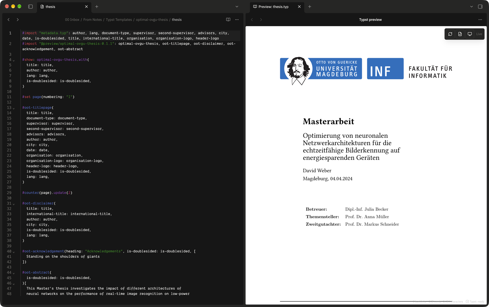
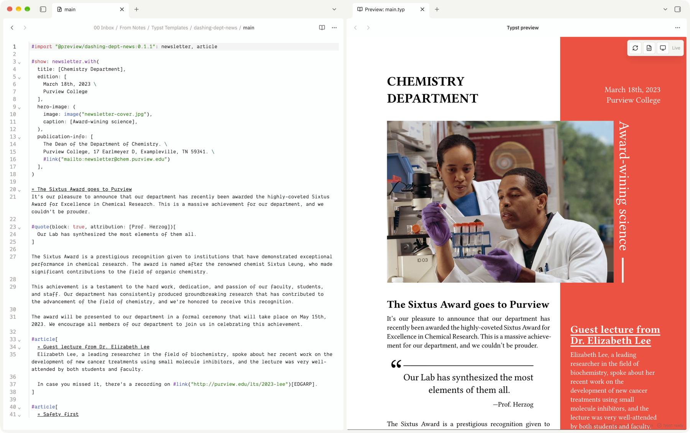

<h1 align="center">Tinymist for Obsidian</h1>

<p align="center">
  <strong>Write Typst in Obsidian. Properly.</strong><br>
  A real Typst editor, a live preview in your workspace, and PDFs that stay ordinary vault files.
</p>

<p align="center">
  <a href="https://community.obsidian.md/plugins/tinymist"></a>
  <a href="https://github.com/wilfriedago/obsidian-tinymist/releases/latest"></a>
  <a href="https://github.com/wilfriedago/obsidian-tinymist/actions/workflows/ci.yml"></a>
  <a href="LICENSE"></a>
</p>

---

[Typst](https://typst.app) is a modern typesetting system — the power of LaTeX
without the pain. This plugin makes `.typ` files a first-class document type in
your vault, backed by
[Tinymist](https://github.com/Myriad-Dreamin/tinymist), the Typst language
server.

Your papers, theses, and reports live beside your notes. Not in another app.

<p align="center">
  
</p>

<p align="center">
  <em>Source on the left, the real rendered document on the right, updating as you type.</em>
</p>

## What you get

| | |
| --- | --- |
| **A real editor** | Syntax highlighting, completion, hover docs, go-to-definition, symbols, folding, and formatting — answered by the Typst compiler itself, not by guesswork. |
| **Errors as you type** | Compiler diagnostics underlined in place, with the real message. No compile-and-squint cycle. |
| **Live preview in your workspace** | The rendered document in an ordinary Obsidian leaf. Split it, move it, pop it out. It updates as you type. |
| **Click to navigate** | Click the rendered page to jump to the source that produced it. Move the caret to scroll the preview. Both directions. |
| **PDFs that are just files** | Export writes a normal PDF into your vault. Obsidian's own viewer opens it, exactly like any other PDF. |
| **Real Typst projects** | A folder with a `typst.toml`, a template, a bibliography, and figures works the way Typst expects. |
| **Offline** | No account, no cloud, no telemetry, and no network requests. |

## Install

**From Obsidian** — open **Settings → Community plugins → Browse**, search for
**Tinymist**, install, and enable. Or use the
[directory page](https://community.obsidian.md/plugins/tinymist).

**Then install Tinymist itself.** The plugin drives the real Typst engine, which
you install separately — Obsidian's developer policies do not allow a plugin to
install or update its own dependencies.

| Platform | Command |
| --- | --- |
| macOS / Linux | `brew install tinymist` |
| Any | `cargo install tinymist-cli` |
| Windows | `scoop install tinymist` · `winget install Myriad-Dreamin.tinymist` |
| Manual | [GitHub releases](https://github.com/Myriad-Dreamin/tinymist/releases) |

Check it worked:

```sh
tinymist -V     # tinymist 0.15.8
```

That is the whole setup. The plugin finds it automatically, including the
package-manager locations a desktop app does not normally see.

### Requirements

- Obsidian **1.13.0+**, desktop. The plugin launches a native executable, which
  Obsidian mobile cannot do.
- A vault stored on the filesystem.
- Tinymist **0.13.0+**.

## Using it

Open any `.typ` file. Tinymist starts on first use, and the status bar shows
what it is doing.

Press the **book** button in the editor's tab bar to open the preview beside
your source. Everything else lives in the command palette:

| Command | |
| --- | --- |
| **Typst: Open preview** | Show the rendered document |
| **Typst: Toggle preview** | Show or hide it |
| **Typst: Export PDF** | Compile and write a PDF into the vault |
| **Typst: Format document** | Reformat the source |
| **Typst: Create new Typst file** | Add a `.typ` file where new notes go |
| **Typst: Show project root** | Which folder this document compiles against |
| **Typst: Restart language server** | Restart Tinymist |

No default hotkeys are set, so nothing collides with yours. Bind your own under
**Settings → Hotkeys**.

The preview's own controls float over the page: refresh, open source, and a
theme button that steps between following the app, light, and dark.

To start a document, right-click any folder in the file explorer and choose
**New Typst file**, or run **Typst: Create new Typst file**. Obsidian's own
**New note** always makes Markdown and its menu cannot be extended, so Typst
files get their own entry right beside it. As with a new note, the name is
selected in the tab title so you can type over `Untitled` straight away — or,
with the tab title bar hidden, asked for in a dialog. Any Typst file can be
renamed from its tab title the same way.

### The status bar

| | |
| --- | --- |
| **Typst: ready** | Running; the document compiles |
| **Typst: compiling** | Working |
| **Typst: 2 errors** | Problems, underlined in the editor |
| **Typst: disconnected** | Tinymist stopped — select to restart |
| **Typst: unavailable** | It could not start — select for the reason |

## Not only papers

Typst does full layout — columns, floats, images, colour, and the
[package ecosystem](https://typst.app/universe). Anything Typst can typeset,
this previews.

<p align="center">
  
</p>

## Projects

Typst resolves imports and absolute paths against a *project root*, which is
not necessarily your vault root. By default the root is the nearest folder
containing a `typst.toml`, and otherwise the document's own folder:

```
vault/
├── notes/
└── papers/
    └── distributed-systems/
        ├── typst.toml          ← makes this folder a project
        ├── main.typ
        ├── bibliography.bib
        └── figures/
```

Without a `typst.toml`, `papers/distributed-systems/main.typ` still gets its own
folder as the root — so two papers never collide.

The alternatives are **Always the vault root** (one project; `/`-absolute
imports reach anywhere) and **A folder I choose**. Changing this restarts
Tinymist, which reads it at startup.

### Bibliographies

`.bib` files open in a plain editor of their own, and **New BibLaTeX file** sits
beside **New Typst file** in a folder's context menu. While a bibliography is
open, the document citing it compiles against what you have typed — saved or
not — and a syntax error in the bibliography is underlined in the bibliography
itself.

A bibliography you edit *outside* Obsidian, or in another plugin, is not picked
up until the citing document is reopened: Tinymist only follows files the
plugin has open. If another plugin already opens `.bib` files, it keeps them,
and the menu entry is not offered.

Hayagriva bibliographies (`.yml`, Typst's own format) are off by default,
because Obsidian cannot tell a bibliography from any other YAML file: turning on
**Editor → Open YAML files as Hayagriva bibliographies** opens *every* `.yml`
and `.yaml` in the vault this way, and adds **New Hayagriva file** to the menu.

## PDF export

Export writes a normal file into your vault, and Obsidian takes it from there.
This plugin **does not** register a PDF view, intercept `.pdf` files, or bundle
a PDF renderer — opening any PDF uses Obsidian's own viewer.

- By default the PDF lands beside its source; set a folder in settings to
  collect them elsewhere.
- With **Replace existing PDFs** off, an existing `name.pdf` is never
  clobbered: the export goes to `name-1.pdf`.
- Intermediate files stay in the plugin's own folder, never in your notes.

## Settings

| Setting | Default | |
| --- | --- | --- |
| Tinymist executable | empty | Empty means "find it automatically" |
| Project root | Automatic | See [Projects](#projects) |
| Preview refresh | As you type | Or on save |
| Preview theme | Follow the app | Light, dark, or follow Obsidian |
| Sync with the editor | on | Click the preview to move the caret, and back |
| Show diagnostics | on | Underline compiler errors |
| Enable the formatter | on | |
| Open YAML files as Hayagriva bibliographies | off | Claims every `.yml`/`.yaml` in the vault |
| PDF folder | empty | Empty means "beside the document" |
| Replace existing PDFs | off | |
| Use system fonts | on | |
| Logging | Off | Raise to `debug` when reporting a problem |

## Privacy and network use

**This plugin makes no network requests.** No telemetry, no analytics, no
accounts, no remote code or styles. Once Tinymist is installed, everything
works offline.

Obsidian's automated review flags two capabilities. Both are inherent to
driving an external compiler, and here is exactly what they amount to:

- **It launches one external program.** `child_process.spawn` starts the
  Tinymist executable, always with `shell: false` and an argument array, so no
  string from a document, filename, or setting is ever handed to a shell. No
  shell is run, and no program other than the one you configured.
- **It has no filesystem access outside your vault.** The plugin imports no
  filesystem module at all — `node:child_process` is the only Node module in
  the bundle. Everything it reads or writes in your vault goes through
  Obsidian's Vault API.

Inside your vault it reads the `.typ` files you open, writes PDFs you export,
and keeps its settings in `.obsidian/plugins/tinymist/`.

**What Tinymist itself reads** once launched is Typst's own behaviour: system
fonts, and Typst's package cache for any `#import` from a package. Tinymist may
fetch a Typst package the first time a document imports one — a Typst feature,
outside the plugin's control, and the only route by which anything here reaches
the internet.

The preview runs a loopback HTTP server that Tinymist starts on an ephemeral
port while a preview tab is open. It is not reachable from other machines, and
has no authentication, so on a shared machine another local process could read
a document you are previewing.

<details>
<summary>Why an automated scan reports "network calls"</summary>

Obsidian's review counts network calls by pattern-matching the built `main.js`.
None of the matches is a request to a remote server:

| What the scanner sees | What it is |
| --- | --- |
| `http://127.0.0.1:<port>/` | The loopback preview server on your own machine |
| `https://github.com/...` | A URL in the build banner comment. Not fetched |
| `"http://"`, `"https://"` | String literals in the bundled Typst grammar, used to recognize links while highlighting |
| `.open(` | `DocumentSession.open()`, the plugin's own method. The pattern also matches `XMLHttpRequest.open`, which is not used |

Confirm it yourself:

```sh
grep -c 'fetch(\|XMLHttpRequest\|new WebSocket\|requestUrl' main.js   # 0
grep -o 'require("[^"]*")' main.js | sort -u                          # no http module
```

</details>

## Troubleshooting

### Tinymist is not found

If `tinymist -V` works in a terminal but the plugin says it is missing: an app
launched from Finder, the Dock, or a desktop shortcut **does not inherit your
shell's `PATH`**. On macOS it gets `/usr/bin:/bin:/usr/sbin:/sbin`, which
excludes Homebrew's `/opt/homebrew/bin`.

```sh
which tinymist        # /opt/homebrew/bin/tinymist
launchctl getenv PATH # usually empty — the GUI default is used instead
```

The plugin works around this by also searching where package managers install
(Homebrew, MacPorts, Cargo, `~/.local/bin`, Snap, Flatpak, scoop, winget). If
yours lives elsewhere, set the full path in settings — that always wins.

### The developer console is full of preview messages

Lines like `recv diff-v1 1388` and `parse 0.20 ms, rerender 2.20 ms` come from
Tinymist's preview frontend, not from this plugin. They are prefixed `(index)`
and originate from `http://127.0.0.1:<port>`.

The preview deliberately runs in a cross-origin iframe, which is what keeps
rendered documents away from Obsidian's DOM and APIs, and a page cannot silence
the console of a frame it does not share an origin with. Filter the console on
`[tinymist:` to see only this plugin's output.

### Something else is wrong

Set **Logging** to `debug` in settings, reproduce, and open the developer
console (**Ctrl/Cmd+Shift+I**). Plugin lines are prefixed `[tinymist:…]`.
Document contents are never logged.

Then [open an issue](https://github.com/wilfriedago/obsidian-tinymist/issues/new/choose).

## Known limitations

- Desktop only.
- Obsidian's find bar does not reach the Typst editor; CodeMirror's own search
  panel (**Ctrl/Cmd+F**) is provided instead.
- Markdown features — backlinks, tags, the outline — do not apply to `.typ`.
- Only one plugin can own the `.typ` extension. Do not enable another Typst
  editor plugin in the same vault.
- Bibliographies are plain text: no highlighting or completion inside them.
- Changing the executable, project, font, or formatter settings restarts
  Tinymist.

## Contributing

Issues and pull requests are welcome — see [CONTRIBUTING.md](CONTRIBUTING.md)
for the development setup, and [SECURITY.md](SECURITY.md) to report a
vulnerability privately.

| | |
| --- | --- |
| [Roadmap](ROADMAP.md) | What is planned, what is not, and why |
| [Architecture](docs/architecture/overview.md) | How the pieces fit, and why |
| [Research](docs/architecture/research.md) | Evidence behind the design decisions |
| [Testing](docs/testing.md) | The automated suite and the manual pass |
| [Compliance](docs/community-plugin-compliance.md) | Against Obsidian's developer policies |
| [Risks](docs/risks.md) | Known weak points, honestly |

## Credits

Built on [Tinymist](https://github.com/Myriad-Dreamin/tinymist) by Myriad-Dreamin,
and [Typst](https://typst.app). Typst syntax highlighting comes from
[codemirror-lang-typst](https://github.com/kxxt/codemirror-lang-typst).

This is an independent, unofficial integration. It is not affiliated with or
endorsed by the Tinymist project, the Typst project, or Obsidian.

## License

MIT — see [LICENSE](LICENSE). Third-party components are listed in
[THIRD_PARTY_NOTICES.md](THIRD_PARTY_NOTICES.md). Tinymist is Apache-2.0 and is
**not** bundled with or modified by this plugin.
